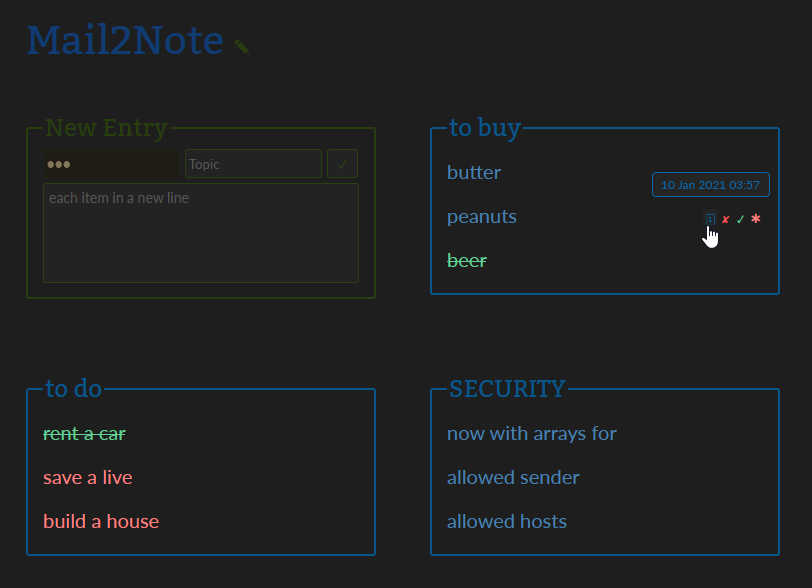

# Mail2Note
this script collects all unread mails from an IMAP account and make a note of every line of each mail  

## Features

- just copy, set mailaccount & run
- set list of allowed sender mailadresses
- set list of allowed sender hosts
- mark notes a done & important
- add new notes via form  

  
